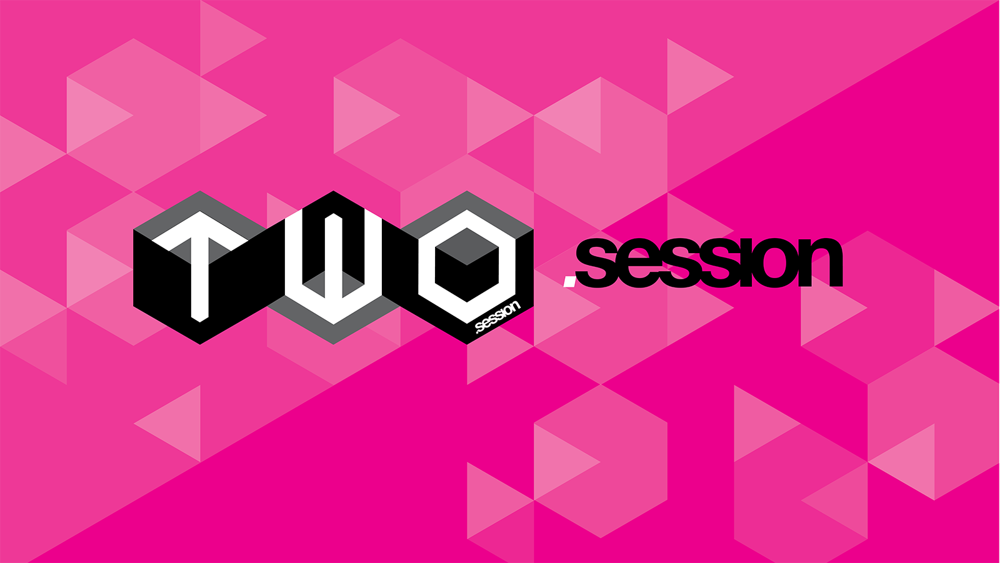
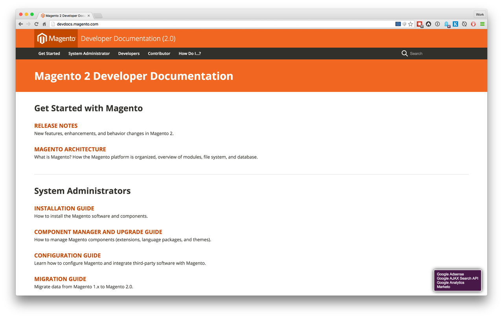
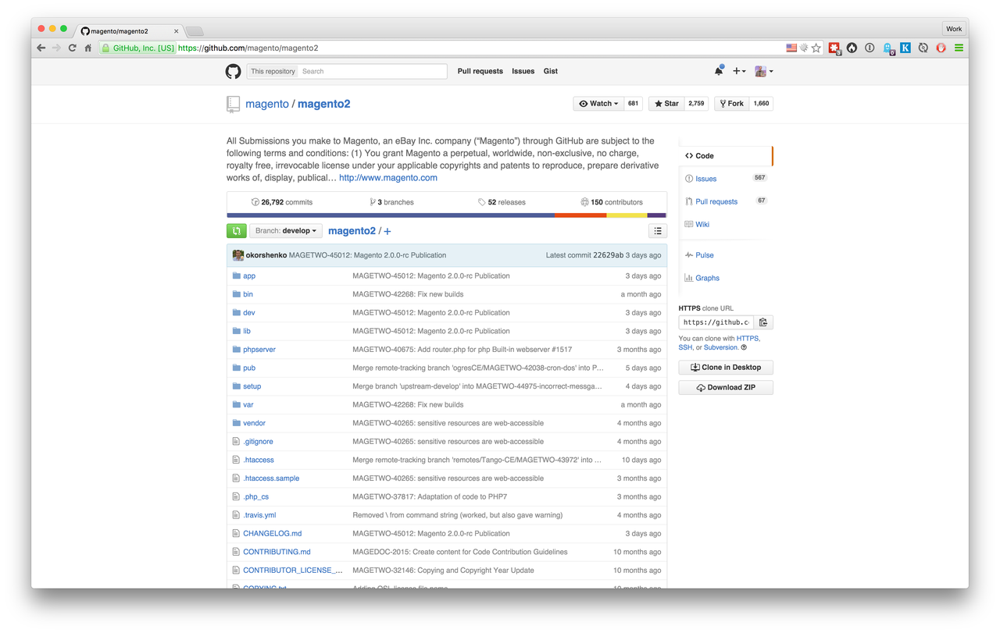

---

## [fit] Magento 2
## what to expect as a developer


^ Hello and thanks for coming along. During this talk I will go through some of the new advancements that Magento 2 offers.

---

### James Cowie
### Technical Team Lead Session Digital
#### t/**@jcowie** gh/**jamescowie**


---

### What's changed since
### [fit] Magento 1


---


---

- 2009 Namespaces
- 2009 Traits
- 2012 Composer
- 2012 Typehinting
- 2013 Generators


---


# The world of 
## [fit] engineering has changed
---

- Server Architecture
- Test Driven Development
- Behaviour Driven Development
- Domain Driven Design


---


# Monolithic
---

# [fit] Composer 


^ in 2011 Jordi Boggiano started out on creating a solution for the PHP community. His goal was to have a reliable package manager for PHP so anyone could create packages that could be used in any project. Composer was going to be the tool that managed a projects dependency by pinning versoins of installed software and could over time manage the dependencies of dependencies.

^ One of the problems we as Magento developers faced was that Magento 1 shipped with a non standard or easily extensible autoloader so any opportunity to load or use these packages was not going to be an easy journey.

---


```json
composer create-project 
   --stability=beta 
   --no-install 
   magento/project-community-edition 
   M2Test
```
---


```json
{
    "name": "magento/project-community-edition",
    "type": "project",
    "require": {
        "magento/product-community-edition": 
        "0.74.0-beta12"
    },
    "require-dev": {
    }
}
```
---
# [fit] Composer can do more 


---


# simple install packages
```bash
 composer require "league/period"
```
---

# Use the package

```php
 1     /**                                                                                                  
 2      * @var League\Period\Period;                                                                        
 3      */
 4     protected $_datePeriod;
 5 
 6     /**                                                                                                  
 7      * @param \League\Period\Period; $datePeriod                                                         
 8      */
 9     public function __construct(\League\Period\Period $datePeriod)
10     {
11         $this->_datePeriod = $datePeriod;
12     }
```

---
# [fit] Versioning
# 1.0.2


^ We may think that version numbers are just there for convinience increase the last digit each time you save the file. But versioning is an extremly powerfull communication tool. If we follow the semantic versioning spectification we can tell people alot about out modules stability. What we are trying to comunicate is what version is our module at. We should follow that the first digit represent any majour releases of this software. Big breaking changes Magento 2 could be 2.0.0 when it first started development. Its a massive change and not one that you can just upgrade to without cause for concern. Now the next digit is minour number this should be incremepnted when you add functionality in a backwards compatiable manour. Your adding new functionality but not breaking any of the old stuff. Finally the last digit is the patch version. Find a bug fix the bug push the patch number up. That way people can see how your module is progressing, AND they can pin via composer there version to only even update to patched versioned or minor versions. Tha is unless we just throw a * in our composer.json dependency.

---
# Exact match


`"magento/product-community-edition": “1.0.1”`

---

# Ranges


`"magento/product-community-edition": “>=1.0, <2”`

---

# Wildcard


`"magento/product-community-edition": “1.0.*”`

---

# Next Significant release


`"magento/product-community-edition": “~1.2”`

---


#Semantic versioning[^2]

[^2]: The full specification can be found at the [http://semver.org](http://semver.org/) website

---


# [fit]Packaging modules for reuse

---

# How to package a Magento 2 module

```json
{
    "name": "SessionDigital/Magento2Module",
    "description": "Magento 2 module to show how to package a module",
    "extra": {
        "map": [
            [
                "*",
                "SessionDigital/Magento2Module"
            ]
        ]
    }
}
```

---

# Use autoloading 

```json
{
    "name": "SessionDigital/Magento2Module",
    "description": "N/A",
    "require": {
        "php": "~5.5.0|~5.6.0|~7.0.0",
        "magento/framework": "100.0.0"
    },
    "type": "magento2-module",
    "version": "1.0.0",
    "license": [
        "OSL-3.0",
        "AFL-3.0"
    ],
    "autoload": {
        "files": [ "registration.php" ],
        "psr-4": {
   		     "SessionDigital\\Magento2Module\\": ""
	    }
    }
}
```

---
# registration.php


```php
<?php
\Magento\Framework\Component\ComponentRegistrar::register(
    \Magento\Framework\Component\ComponentRegistrar::MODULE,
    'SessionDigital_Magento2Module',
    __DIR__
);
```

---

# Decouple from the framework


---


# What are the benefits

   - Clean Code 
   - Reusable packages
   - Testable
   - Easier to read
   - Easier to maintain

---

# [fit] The naked
# Magento module


^ The idea of the naked module is to create code that is completely unaware that it will be applied within a Magento application. This would mean that it can also be applied to a new version of Magento with a greatly reduced amount of re-work. We get to apply DRY in the true form and only create the new wiring to Magento 2 or 3 or 4. Magento will last for ever you know!

---

# [fit]Dependency Injection   

## In magento 2


---


```php
public function __construct(
        \Magento\Framework\App\Action\Context $context,
        \Magento\Catalog\Model\Design $catalogDesign,
        \Magento\Catalog\Model\Session $catalogSession,
        \Magento\Framework\Registry $coreRegistry,
        \Magento\Store\Model\StoreManagerInterface $storeManager,
        \Magento\CatalogUrlRewrite\Model\CategoryUrlPathGenerator $categoryUrlPathGenerator,
        PageFactory $resultPageFactory,
        \Magento\Framework\Controller\Result\ForwardFactory $resultForwardFactory,
        Resolver $layerResolver,
        CategoryRepositoryInterface $categoryRepository
        \Magento\Framework\App\Action\Context $context,
        \Magento\Catalog\Model\Design $catalogDesign,
        \Magento\Catalog\Model\Session $catalogSession,
        \Magento\Framework\Registry $coreRegistry,
        \Magento\Store\Model\StoreManagerInterface $storeManager,
        \Magento\CatalogUrlRewrite\Model\CategoryUrlPathGenerator
        ) {
        	...
        }
```        

---


# Code Smell

---


   - replaces Mage:: god class
   - Dependency Injection can be overused. 
   - Enables composition.

---


# Before dependency injection

```php
 1 <?php
 2 class Sample
 3 {
 4     protected $logger;
 5 
 6     public function doSomething()
 7     {
 8         $this->logger = new \Logger();
 9         $logger->doSomething();
10     }
11 }
```

---

# Magento 2 DI


```php
 1 <?php
 2 class SampleDi {
 3   protected $logger;
 4   public function __construct(\Logger $logger) {
 5     $this->logger = $logger;
 6   }
 7 
 8   public function doSomething() {
 9     $this->logger->doSomething();
10   }
11 }
```

---

# What are the benefits ?


   - Responsibility  
   - Swap concrete implementation
   - Mock the dependency

---


# Its not just objects 

```xml
<type name="Magento\Cms\Model\Wysiwyg\Images\Storage">
  <arguments>
    <argument name="extensions" xsi:type="array">
         <item name="allowed" xsi:type="array">
           <item name="jpg" xsi:type="number">1</item>
           <item name="jpeg" xsi:type="number">1</item>
           <item name="png" xsi:type="number">1</item>
           <item name="gif" xsi:type="number">1</item>
          </item>
     </argument>
  </arguments>
…
```

---

# DI.xml[^3]


```xml
<?xml version="1.0"?>
<config xmlns:xsi="http://www.w3.org/2001/XMLSchema-instance"
        xsi:noNamespaceSchemaLocation="/lib/internal/Magento/Framework/ObjectManager/etc/config.xsd">

    <type name="Magento\Framework\View\TemplateEngineFactory">
        <arguments>
            <argument name="engines" xsi:type="array">
                <item name="twig" xsi:type="string">SchumacherFM\Twig\Framework\View\TemplateEngine\Twig</item>
            </argument>
        </arguments>
    </type>
</config>
```

[^3]: Cyrill Schumacher's [Twig extension](https://github.com/SchumacherFM/Magento2-Twig)

^ Magento 2 comes with an advanced dependency injection container. Its power can be seen with this example. My default Magento 2 uses phtml as its template engine however by using the di.xml file we can easily change this template enging to be something else. Cyrill Schumacher did this on a flight back to Australia. So how does it work ? Well the template engine factory class has a contructor argument injected into it that is the template engine to use. Because the DI container gets compilled when this file gets parsed we are replacing the default engine with our new twig implementation. 

---


# [fit] Service Contracts
   - PHP Interfaces
   - Public API of the class
   - Design by contract [^1]

[^1]: [Design by contract](https://en.wikipedia.org/wiki/Design_by_contract)   

---


# [fit] Customer repository service contract

```php
<?php
namespace Magento\Customer\Api;
interface CustomerRepositoryInterface
{
    public function save(\Magento\Customer\Api\Data\CustomerInterface $customer, $passwordHash = null);
    public function get($email, $websiteId = null);
    public function getById($customerId);
    public function getList(\Magento\Framework\Api\SearchCriteriaInterface $searchCriteria);
    public function delete(\Magento\Customer\Api\Data\CustomerInterface $customer);
    public function deleteById($customerId);
}
```

---


# Annotations

```php
    /**
     * Create customer.
     *
     * @api
     * @param \Magento\Customer\Api\Data\CustomerInterface $customer
     * @param string $passwordHash
     * @return \Magento\Customer\Api\Data\CustomerInterface
     * @throws \Magento\Framework\Exception\InputException If bad input is provided
     * @throws \Magento\Framework\Exception\State\InputMismatchException If the provided email is already used
     * @throws \Magento\Framework\Exception\LocalizedException
     */
    public function save(\Magento\Customer\Api\Data\CustomerInterface $customer, $passwordHash = null);
```

^ Magento 2 uses annotations heavily thoughout the code base to provide extra helpers at compile or runtime. When we create service contracts we need to ensure we add the annotation @api to each of the public methods to indicate that these are public API's. This gives us the advantage of not only describing the API of the class for developers but it also makes these methods available via the REST and Soap API's. We no longer need to create extra XML configuration to define the API methods

---


---


> Untested code is incomplete code

-- Ben Marks @ Magento

---



### [http://devdocs.magento.com](http://devdocs.magento.com)

^ Magento are aware that there is going to be a steep learning curve for Magento 2. So they are trying to meet developers half way and provide comprehensive documentation on all features of the framework. The documentations is tested weekly and can be modified by anyone using Github. 

---



--- 

# [fit] Thank you...


