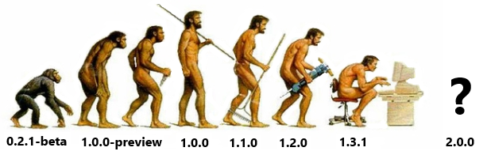

---

## [fit] Magento 2
## what to expect as a developer


^ Hello and thanks for coming along. During this talk I will go through what we as developer can expect from Magento 2. What new technologies, patterns and princuples we can expect to see and use while working with Magento 2

---

### James Cowie
### Technical Team Lead Session Digital
#### t/**@jcowie** gh/**jamescowie**


^ I am a TTL working on one of the Magento 2 projects. For the past few months I have been activly involved in the Magento 2 merchant beta. As well as being involved in the Developer beta at the start of the year

---

### What's changed since
### [fit] Magento 1


^ Before we look at what is new in Magento 2 its important to take a look at what has changed since Magento 1 was first released all those years back. A lot of time has passed since the first release 7+ years back

---


^ The largest change has been the core language itself. 

---

- 2009 Namespaces
- 2009 Traits
- 2012 Composer
- 2012 Typehinting
- 2013 Generators


^ All of these core language features and composer have been developed after the first release of Magento. 

---


# The world of 
## [fit] engineering has changed

^ Not only has the language changed, the way we look at the architecture of projects has changed. 

---

- Server Architecture
- Test Driven Development
- Behaviour Driven Development
- Domain Driven Design


^ How we deploy and where we deploy to has changed. Our options are increasing than just having to buy physical space in data centres. 
^ TDD has become more prominent in PHP thanks to the progress made by PHPUnit and others, 
^ BDD has seen the first supporting tools emerge in the form of Behat and PHPSpec
^ And more recently the excitment and acknowledgment of DDD in the PHP Communits

---


# Magento 1 Installation

^ I bet a good percentage of people here created there own process to install Magento 1. Be this is a seed repository or bash script. 

---


# Monolithic

^ One of the reasons behind having to do this was because Magento 1 was a monolithic system. By nature we had to visit magentocommerce.com and download a compressed package of all the source code for either CE or EE. Remembering at the time of creation for M1 there was no composer, No NPM composable applications was still a thing to come.

---

# [fit] Composer 


^ in 2011 Jordi Boggiano started out on creating a solution for the PHP community. His goal was to have a reliable package manager for PHP so anyone could create packages that could be used in any project. Composer was going to be the tool that managed a projects dependency by pinning versoins of installed software and could over time manage the dependencies of dependencies.

^ One of the problems we as Magento developers faced was that Magento 1 shipped with a non standard or easily extensible autoloader so any opportunity to load or use these packages was not going to be an easy journey.

---


# Magento 2 Installation

^ Thankfully composer now features at the core of Magento 2. You can navigate far through the source code without finding a reference to a composer manifest. In fact you shouldnt install Magento 2 without composer. Enterprise EE is a set of additional modules that we install ontop of CE so no longer are there 2 packages for the different versions.

---


```json
composer create-project 
   --stability=beta 
   --no-install 
   magento/project-community-edition 
   M2Test
```

^ Because Magento 2 project package has been added to packagist we can use the composer CLI tool to create us a new project based on the depdendcies of that project. Lots more efficient than magento 1.

---


```json
{
    "name": "magento/project-community-edition",
    "type": "project",
    "require": {
        "magento/product-community-edition": 
        "merchant_beta"
    },
    "require-dev": {
    }
}
```

^ Now the output of the CLI process, other than some of the initial source files is what we refer to as the composer manifest file or composer.json. Whats important is what we see inside the require node as that is the package to install and the exact version we want installing.

---

# [fit] Composer can do more 


^ First impressions are that composer is just a tool to download and install a package. Well it can do lots more than that. For the first time Magento developers can truely embrace the vast knowledge of the PHP community and easily re use there works. Packagist is the largest searchable directory of PHP packages for any need. Instead of having to write our own packages for PDF manipulation etc we can do look to the community to be our experts. We just need to know where to look.

---


# simple install packages

```bash
 composer require "league/period"
```

^ Installing these community packages into Magento 2 is just as easy. Via the CLI we just use the require flag to instruct composer to add that package to our project.

---


# Use the package

```php
 1     /**                                                                                                  
 2      * @var League\Period\Period;                                                                        
 3      */
 4     protected $_datePeriod;
 5 
 6     /**                                                                                                  
 7      * @param \League\Period\Period; $datePeriod                                                         
 8      */
 9     public function __construct(\League\Period\Period $datePeriod)
10     {
11         $this->_datePeriod = $datePeriod;
12     }
```

^ THen within our Magento 2 project source code we can just use the package as we would any other PHP Framework. The days of the `lib` folder in Magento 1, as well as the non standard autoloading days are behind us. Because Magento 2 autoloading follows the PSR standards its as simle as search, fine, require and use. 

---
# [fit] Versioning
# 1.0.2


^ We may think that version numbers are just there for convinience increase the last digit each time you save the file. But versioning is an extremly powerfull communication tool. If we follow the semantic versioning spectification we can tell people alot about out modules stability. What we are trying to comunicate is what version is our module at. We should follow that the first digit represent any majour releases of this software. Big breaking changes Magento 2 could be 2.0.0 when it first started development. Its a massive change and not one that you can just upgrade to without cause for concern. Now the next digit is minour number this should be incremepnted when you add functionality in a backwards compatiable manour. Your adding new functionality but not breaking any of the old stuff. Finally the last digit is the patch version. Find a bug fix the bug push the patch number up. That way people can see how your module is progressing, AND they can pin via composer there version to only even update to patched versioned or minor versions. Tha is unless we just throw a * in our composer.json dependency.

---
# Exact match


`"magento/product-community-edition": “1.0.1”`

---

# Ranges


`"magento/product-community-edition": “>=1.0, <2”`

---

# Wildcard


`"magento/product-community-edition": “1.0.*”`

---

# Next Significant release


`"magento/product-community-edition": “~1.2”`

---


#Semantic versioning[^2]

[^2]: The full specification can be found at the [http://semver.org](http://semver.org/) website

^ Major -> Breaking changes , 
^ Minor -> Feature enhancments non BC, 
^ Patch -> Bug fix, security fix

---


# [fit]Packaging modules for reuse

^ We always had code reuse in Magento 1 thanks to the advancments made in Modman, The hackathon projects and to some extent connect. Yet because we can use packages so freely now its important for us to see how we can package our Magento 2 module for either open source or other projects.

---


# How to package a Magento 2 module

```json
{
    "name": "SessionDigital/Magento2Module",
    "description": "Magento 2 module to show how to package a module",
    "extra": {
        "map": [
            [
                "*",
                "SessionDigital/Magento2Module"
            ]
        ]
    }
}
```

^ If you have been looking at Magento 2 from earlier this year you may be familiar with this mapping concept in the composer manifest. Up until recently Magento 2 still required the source files for module to physically be placed into the `app/code` folder so they could be loaded. We can still use this method and define our mappings of source -> destination.

---


# Use autoloading 

```json
{
    "name": "SessionDigital/Magento2Module",
    "description": "N/A",
    "require": {
        "php": "~5.5.0|~5.6.0|~7.0.0",
        "magento/framework": "100.0.0"
    },
    "type": "magento2-module",
    "version": "1.0.0",
    "license": [
        "OSL-3.0",
        "AFL-3.0"
    ],
    "autoload": {
        "files": [ "registration.php" ],
        "psr-4": {
   		     "SessionDigital\\Magento2Module\\": ""
	    }
    }
}
```

^ Thanks to the combined efforts between Magento 2 core team and the community, we now have the ability to use our dependencies without having to place them in the code directory. If you are used to working with other PHP frameworks, Symfony for example you will know that when composer installs a dependency it does not copy it into our src folder. Instead we rely on composer's autoloading feature to enable these modules. And this is what we can now do with Magento 2. What is different is that we need to define our module as being of "type" Magento2-module and then in the autoload section we specify a autoload file to be ran: registration.php and our PSR4 namespace.

---
# registration.php


```php
<?php
\Magento\Framework\Component\ComponentRegistrar::register(
    \Magento\Framework\Component\ComponentRegistrar::MODULE,
    'SessionDigital_Magento2Module',
    __DIR__
);
```

^ This registration.php file is the same for all modules we install, only expection to this rile is registar can be of type MODUlE or THEME. But all we are really doing is registering our module with Magento 2 env.php for initialisation into the framework.

---

# [fit]Decouple from 
# [fit]the framework


^ Not new for Magento but if you look at any technical conference from the past 2+ years you will see many people promoting the idea that we should not couple ourselves to a framework. Not that frameworks are evil or wrong. Just that we are specalists in our own Business domains so we should write decoupled clean code than can be used in a framework,

---


# What are the benefits

   - Clean Code 
   - Reusable packages
   - Testable
   - Easier to read
   - Easier to maintain

^ De coupled code is clean code it can express its intent far more clearer than if mixed in with framework implementations,
^ Re usable packages not only between Magento projects but between frameworks.
^ De coupled code by nature is more testable. We are not having to write tests cases for the framework, Mocks for DB etc.

---

# [fit] The naked
# Magento module


^ The idea of the naked module is to create code that is completely unaware that it will be applied within a Magento application. This would mean that it can also be applied to a new version of Magento with a greatly reduced amount of re-work. We get to apply DRY in the true form and only create the new wiring to Magento 2 or 3 or 4. Magento will last for ever you know!

---

# [fit]Dependency Injection   

## In magento 2


^ Magento 2 could not be a modern framework and continue to power e-commerce if it did not adopt dependency injection. The DI container within Magento 2 is an extremly complicated but powerfull tool we now have in our developer toolbox. Similar in concept to the Symfony DI container it allows us to inject dependencies directly into the constructor. The DI compiller can then inject the correct dependencies if we are working from interfaces, It has code generation and will inject factories to name just a few

---


```php
public function __construct(
        \Magento\Framework\App\Action\Context $context,
        \Magento\Catalog\Model\Design $catalogDesign,
        \Magento\Catalog\Model\Session $catalogSession,
        \Magento\Framework\Registry $coreRegistry,
        \Magento\Store\Model\StoreManagerInterface $storeManager,
        \Magento\CatalogUrlRewrite\Model\CategoryUrlPathGenerator $categoryUrlPathGenerator,
        PageFactory $resultPageFactory,
        \Magento\Framework\Controller\Result\ForwardFactory $resultForwardFactory,
        Resolver $layerResolver,
        CategoryRepositoryInterface $categoryRepository
        \Magento\Framework\App\Action\Context $context,
        \Magento\Catalog\Model\Design $catalogDesign,
        \Magento\Catalog\Model\Session $catalogSession,
        \Magento\Framework\Registry $coreRegistry,
        \Magento\Store\Model\StoreManagerInterface $storeManager,
        \Magento\CatalogUrlRewrite\Model\CategoryUrlPathGenerator
        ) {
        	...
        }
```        

^ This was one of the examples that got tweeted the world over. One of the earlier constructor arguments from an early M2 build. There were more dependencies getting added but I was not sure how large the projector screen would be 

---


# Code Smell

^ What this helped identify though was that the classes being pulled in from Magento 1 were doing far too much, We can use this in our development. Now we have to inject all of our classes's depedencies we can actually see what it needs to function and easily identify if we are breaking some of the common patterns of software design.

---

## Quick recap on DI in Magento 2


   - replaces Mage:: god class
   - Dependency Injection can be overused. 
   - Enables composition.

---


# Before dependency injection

```php
 1 <?php
 2 class Sample
 3 {
 4     protected $logger;
 5 
 6     public function doSomething()
 7     {
 8         $this->logger = new \Logger();
 9         $this->logger = Mage::getModel('core/logger'); 
10         $logger->doSomething();
11     }
12 }
```

^ Before we had DI in Magento, we would commonly do this, Either create new instances of objects directly in our class methods, or use the mage god class to pull anything and everything our of a complex factory. Dont get me wrong, This has worked and is still working today for projects. Where this breaks down is if we want to swap all implementations of Logger for another type, Or when we are testing. Its very hard to tests this code because of the hard dependency on the objects they are creating.

---

# Magento 2 DI


```php
 1 <?php
 2 class SampleDi {
 3   protected $logger;
 4   public function __construct(\Logger $logger) {
 5     $this->logger = $logger;
 6   }
 7 
 8   public function doSomething() {
 9     $this->logger->doSomething();
10   }
11 }
```

^ Magento 2 supports constructor injection. It is possible to use setters but the examples you will see and read in the core all implement the use of constructor injection. As the name implies we are injecting our dependencies directly into the constructor to allow the object to then use them.

---

# What are the benefits ?


   - Responsibility  
   - Swap concrete implementation
   - Mock the dependency

^ Responsibility, We are moving the responsibility of creation of these objects away from the class that uses them. Making the objects responsible for ideally only one thing When we look at DI.xml and the more advanced configuration of the M2 container we will see how by just updating the containers XML we can completly change the concrete implementation without having to touch the PHP classes. Because we are injecting into the constrcutor using PHPSpec, PHPUnit etc its far more easire for us to mock the dependencies meaning that our tests no longer have to talk to the underlying architecture. 

---


# It's not just object's 

```xml
<type name="Magento\Cms\Model\Wysiwyg\Images\Storage">
  <arguments>
    <argument name="extensions" xsi:type="array">
         <item name="allowed" xsi:type="array">
           <item name="jpg" xsi:type="number">1</item>
           <item name="jpeg" xsi:type="number">1</item>
           <item name="png" xsi:type="number">1</item>
           <item name="gif" xsi:type="number">1</item>
          </item>
     </argument>
  </arguments>
…
```

^ Because of how the container is designed its not only objects that can be injected. In the core they are also injecting strings into the image storeage class settins what image types this class cab use.

---

# DI.xml[^3]


```xml
<?xml version="1.0"?>
<config xmlns:xsi="http://www.w3.org/2001/XMLSchema-instance"
        xsi:noNamespaceSchemaLocation="/lib/internal/Magento/Framework/ObjectManager/etc/config.xsd">

    <type name="Magento\Framework\View\TemplateEngineFactory">
        <arguments>
            <argument name="engines" xsi:type="array">
                <item name="twig" xsi:type="string">SchumacherFM\Twig\Framework\View\TemplateEngine\Twig</item>
            </argument>
        </arguments>
    </type>
</config>
```

[^3]: Cyrill Schumacher's [Twig extension](https://github.com/SchumacherFM/Magento2-Twig)

^ Magento 2 comes with an advanced dependency injection container. Its power can be seen with this example. My default Magento 2 uses phtml as its template engine however by using the di.xml file we can easily change this template enging to be something else. Cyrill Schumacher did this on a flight back to Australia. So how does it work ? Well the template engine factory class has a contructor argument injected into it that is the template engine to use. Because the DI container gets compilled when this file gets parsed we are replacing the default engine with our new twig implementation. 

---


# [fit] Service Contracts
   - PHP Interfaces
   - Public API of the class
   - Design by contract [^1]

[^1]: [Design by contract](https://en.wikipedia.org/wiki/Design_by_contract)   

^ Service contracts or Interfaces as the PHP language defines them are great ways of creating a "Contract" of intent for how the class should be used and what it will do. The service contracts within Magento 2 serves 2 purposes. It provides the interfaces that define how our classes behave and are used in the DI.xml so we can inject concrete types but via DI change these types. And it also provides the public Rest / Soap API's that can be consumed 

---


# [fit] Customer repository service contract

```php
<?php
namespace Magento\Customer\Api;
interface CustomerRepositoryInterface
{
    public function save(\Magento\Customer\Api\Data\CustomerInterface $customer, $passwordHash = null);
    public function get($email, $websiteId = null);
    public function getById($customerId);
    public function getList(\Magento\Framework\Api\SearchCriteriaInterface $searchCriteria);
    public function delete(\Magento\Customer\Api\Data\CustomerInterface $customer);
    public function deleteById($customerId);
}
```

^ When working with Magento 2 we should make sure that we always use the Service Contracts and not fall back to pulling models from the Object Manager. We will find these Interfaces within the API folder of our modules and they are contracts for what you can use from our module method wise. Interfaces combined with semantic versioning should mean that code breaks based on incompatabilties are a thing of the past. But with this example we can clearly see that when we want to interact with a customer we can call one of methods. We dont need to be concerned with how they are getting the data just that based on the return types and input we know we can get save delete etc. If we wanted to change this behaviour to not save into a database, We could implement this interface in our own module and use the DI.xml to inject a new implementation into the core so that when saving a customer we use mailchimp instead.

---


# Annotations

```php
    /**
     * Create customer.
     *
     * @api
     * @param \Magento\Customer\Api\Data\CustomerInterface $customer
     * @param string $passwordHash
     * @return \Magento\Customer\Api\Data\CustomerInterface
     * @throws \Magento\Framework\Exception\InputException If bad input is provided
     * @throws \Magento\Framework\Exception\State\InputMismatchException If the provided email is already used
     * @throws \Magento\Framework\Exception\LocalizedException
     */
    public function save(\Magento\Customer\Api\Data\CustomerInterface $customer, $passwordHash = null);
```

^ Magento 2 uses annotations heavily thoughout the code base to provide extra helpers at compile or runtime. When we create service contracts we need to ensure we add the annotation @api to each of the public methods to indicate that these are public API's. This gives us the advantage of not only describing the API of the class for developers but it also makes these methods available via the REST and Soap API's. We no longer need to create extra XML configuration to define the API methods

---


^ Magento 1 did later in its life get the TAF ( test automation framework ). Yet it was not baked in from the start so adoption was sparse. Magento 2 core team knew that they would not be able to develop a leading E-commerce framework without the inclusions of Unit tests, Functional tests and Integration tests. Every single module in the Magento 2 core now has each of the 3 test types bundled with it. Testing is now considered to be the norm in M2 development and not the expection. What is also exciting is that all modules that are going to be considered for Connect have to include tests as part of there approval process

---


> Untested code is incomplete code

-- Ben Marks @ Magento

---


### [http://devdocs.magento.com](http://devdocs.magento.com)

^ Magento are aware that there is going to be a steep learning curve for Magento 2. So they are trying to meet developers half way and provide comprehensive documentation on all features of the framework. The documentations is tested weekly and can be modified by anyone using Github. 

---

### [http://github.com/magento/magento2](http://github.com/magento/magento2)


--- 

# [fit] Thank you...


