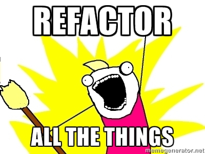

## [fit] The _**de constructed**_
## [fit] Magento module
---

### James Cowie
### Technical Team Lead Session Digital
#### t/**@jcowie** gh/**jamescowie**
##### 2016 Magento Master _mover_
---

# [fit] deconstruct...

**verb** | de·con·struct \ˌdē-kən-ˈstrəkt\ |

> To take apart or examine in order to reveal the basis or composition of ?often with the intention of exposing biases, flaws, or inconsistencies
-- Wayne Karlin

---

# [fit]deconstruction in software

---

# The *Law* of Demeter (LoD)

>Or principle of least knowledge is a design guideline for developing software, particularly object-oriented programs. In its general form, the LoD is a specific case of loose coupling. [^1]

[^1]: https://en.wikipedia.org/wiki/Law_of_Demeter

---


---

# [fit]What is **de**coupled code ?

---

**Tight coupling**

Tight coupling is when a group of classes are highly dependent on one another. This scenario arises when a class assumes too many responsibilities, or when one concern is spread over many classes rather than having its own class.[^1]

[^1]: https://en.wikipedia.org/wiki/Coupling_(computer_programming)

---

**Loose coupling**

Loosely coupled code is where each of a systems modules has, or makes use of, little or no knowledge of the definitions of other separate modules[^1]

[^1]: https://en.wikipedia.org/wiki/Loose_coupling

---

# High Cohesion
> Modules with high cohesion tend to be preferable, because high cohesion is associated with several desirable traits of software including robustness, reliability, reusability, and understandability. [^1]

[^1]: https://en.wikipedia.org/wiki/Cohesion_(computer_science)

---

# Low Cohesion
> In contrast, low cohesion is associated with undesirable traits such as being difficult to maintain, test, reuse, or even understand.[^1]

[^1]: https://en.wikipedia.org/wiki/Cohesion_(computer_science)

---


---

# **D**on't **R**epeat **Y**ourself[^⌘]

[^⌘]: Cut: Command ⌘ - x, Copy: Command ⌘ - c, Paste: Command ⌘ - v


---

# [fit] Traits


^ Oh wait, then the language authors and fellow programmers go and provide another way to misrepresent reuse and tempt us into thinking we are following DRY principles. This is closer but can provide a false sense of accomplishment.

---

# [fit] Composition


^ Throughout Magento 1 development the main way to develop was to use Inheritance over Composition. We had to do this for many reasons, No concrete way to inject dependencies etc etc. But as we have evolved we know we should favour Composition over Inheritache so what is composition ? When we talk about inheritance we tend to use " Is a " relationship. My class "Is a" database class. However with composition lets start talking about our code as "Has a" or "Uses a", We can then start to de couple the creation of objects and services from the classes that are useing some part of them. E.g. This UserSignup class "Uses" the database. We are composing out objects of all the ingredients that is required to make the work.

---

# ⎏
# [fit] Interfaces


---

# Code Time
#### Create an out of stock command that emails store admin using Mandrill because that never changes does it :)
---

```php
<?php namespace MageTitans\Emailer\Commands;

use Symfony\Component\Console\Input\InputInterface;
use Symfony\Component\Console\Input\InputArgument;
use Symfony\Component\Console\Input\InputOption;
use Symfony\Component\Console\Output\OutputInterface;
use Symfony\Component\Console\Command\Command;

class EmailCommand extends Command
{
    protected function configure()
    {
        $this->setName('magetitans:email');
        $this->setDescription('Send all email out to people about how much stock is remaining');
        parent::configure();
    }

    protected function execute(InputInterface $input, OutputInterface $output)
    {
        $emailer = new Mandrill('SOMEAPIKEY');

        $message = array(
            'subject' => 'Out of stock email',
            'from_email' => 'you@yourdomain.com',
            'html' => '<p>You are being notified about product stock information!.</p>',
            'to' => array(array('email' => 'recipient1@domain.com', 'name' => 'Recipient 1')),
            'merge_vars' => array(array(
                'rcpt' => 'recipient1@domain.com',
                'vars' =>
                    array(
                        array(
                            'name' => 'FIRSTNAME',
                            'content' => 'Recipient 1 first name'),
                        array(
                            'name' => 'LASTNAME',
                            'content' => 'Last name')
                    ))));

        $template_name = 'Products';

        // load all products
        $objectManager = \Magento\Framework\App\ObjectManager::getInstance();

        $productCollection = $objectManager->create('Magento\Catalog\Model\ResourceModel\Product\CollectionFactory');

        $collection = $productCollection->create()
            ->addAttributeToSelect('*')
            ->addAttributeToFilter('stock_status', 0)
            ->load();

        $productHtml = '';

        foreach ($collection as $product) {
            $productHtml .= '<p>' . $product->getName() . '</p>';
        }

        $template_content = array(
            array(
                'name' => 'main',
                'content' => 'Hi *|FIRSTNAME|* *|LASTNAME|*, thanks for signing up.'),
            array(
                'name' => 'footer',
                'content' => 'Copyright 2016.')

        );

        $emailer->messages->sendTemplate($template_name, $template_content, $message);

        $output->writeln("Email is sent for out of stock products");
    }
}
```
---


---

```php
class EmailCommand extends Command
{
  protected function configure() { .. }

  protected function execute(InputInterface $input, OutputInterface $output)
  {
  ...
  }
}
```
---

```php
...
$emailer = new Mandrill('SOMEAPIKEY');

$message = array(
  'subject' => 'Out of stock email',
  'from_email' => 'you@yourdomain.com',
  'html' => '<p>You are being notified about product stock information!.</p>',
  'to' => array(array('email' => 'recipient1@domain.com', 'name' => 'Recipient 1')),
  'merge_vars' => array(array(
  'rcpt' => 'recipient1@domain.com',
  'vars' =>
    array(
        array(
            'name' => 'FIRSTNAME',
            'content' => 'Recipient 1 first name'),
        array(
            'name' => 'LASTNAME',
            'content' => 'Last name')
))));

$template_name = 'Products';
...
```

---

```php
...
$objectManager = \Magento\Framework\App\ObjectManager::getInstance();

$productCollection = $objectManager->create(
  'Magento\Catalog\Model\ResourceModel\Product\CollectionFactory'
);

$collection = $productCollection->create()
    ->addAttributeToSelect('*')
    ->addAttributeToFilter('stock_status', 0)
    ->load();

$productHtml = '';

foreach ($collection as $product) {
    $productHtml .= '<p>' . $product->getName() . '</p>';
}
...
```

---

```php
...
$template_content = array(
    array(
        'name' => 'main',
        'content' => 'Hi *|FIRSTNAME|* *|LASTNAME|*.'),
    array(
        'name' => 'footer',
        'content' => 'Copyright 2016.')

);

$emailer->messages->sendTemplate(
  $template_name, $template_content, $message
);

$output->writeln("Email is sent for out of stock products");
```
---


---

# Attempt 1
   - All logic enclosed in a single method
   - No reuse
   - Hard to understand
   - Hard to change

---

# Issues with the class
   - Fragility
   - Cost of change
   - Technical debt

---

# Fragility
   - No tests
   - Mixed business logic and framework

---

# Cost of change
   - Email may be used throughout the app
   - Hard to understand
   - Becomes "*That class*"


---

# Technical debt
   - Cost of code over time
   - Impact on speed of change

---

# What is our method actually doing ?
   - Building vars for email sending
   - Getting all products that are out of stock
   - Sending the email


---



---

EmailCommand.php
# *Becomes*
   - Model/Emailer.php
   - Model/OutOfStockProducts.php
   - Commands/EmailCommand.php

---

# Model for Emailer

```php
namespace MageTitans\BetterEmailer\Model;

class Emailer
{
  public function setTemplate(array $templateData)
  { ... }

  public function sendEmail($ApiKey, $templateName, $templateContent, $message)
  { ... }
}
```
---

# Model for OOS products

```php
namespace MageTitans\BetterEmailer\Model;

class OutOfStockProducts
{
  public function getOutOfStockProducts()
  { ... }
}
```
---

#Emailer Command

```php
<?php namespace MageTitans\BetterEmailer\Commands;

use Symfony\Component\Console\Input\InputInterface;
use Symfony\Component\Console\Input\InputArgument;
use Symfony\Component\Console\Input\InputOption;
use Symfony\Component\Console\Output\OutputInterface;
use Symfony\Component\Console\Command\Command;

class EmailCommand extends Command
{
    protected function configure()
    {
        $this->setName('magetitans:betteremail');
        $this->setDescription('Send all email out to people about how much stock is remaining');
        parent::configure();
    }

    protected function execute(InputInterface $input, OutputInterface $output)
    {
        $products = new \MageTitans\BetterEmailer\Model\OutOfStockProducts();
        $emailer = new \MageTitans\BetterEmailer\Model\Emailer();

        $emailTemplate = $emailer->setTemplate(['name' => 'james', 'lastname' => 'cowie', ]);
        $emailer->sendEmail('SOMEAPIKEY','products',$emailTemplate, $products->getOutOfStockProducts());

        $output->writeln("Email has been sent");
    }
}
```
---

# Getting better
   - Separate class and methods
      - Easier to test
      - Easier to understand
      - Extracted from the framework

---


---

# Attempt 3
   - Interfaces
   - Dependency Injection   

---

# Interfaces *AKA* Service Contracts


```php
<?php

interface Emailer
{
    public function send($templateName, $templateContent, $message);
    public function setVariables(array $templateData);
}
```

---
# Why are interfaces important ?
   - Contract for other developers to follow
   - Aid in testing
   - Backwards Compatibility breaks
   - Type safe checking

---
#SOLID[^1]

*S* – Single-responsiblity principle
*O* – Open-closed principle
*L* – Liskov substitution principle
*I* – Interface segregation principle
*D* – Dependency Inversion Principle

[^1]:Robert C. Martin

---

#S*O*LID

*O* – Open-closed principle

`This simply means that a class should be easily extendable without modifying the class itself`

---

# Implement our Interfaces
####  "Model/Emailers/Mandrill.php"
```php
<?php namespace MageTitans\ImprovedEmailer\Model\Emailers;

use MageTitans\ImprovedEmailer\Api\EmailerInterface;

class Mandrill implements EmailerInterface
{
    public function setVariables(array $templateData)
    { ... }

    public function send($templateName, $templateContent, $message)
    { ... }
}

```
---
# Back to our command

```php
/** @var \MageTitans\ImprovedEmailer\Api\EmailerInterface  */
protected $emailer;

/** @var OutOfStockProducts  */
protected $outOfStockProducts;

public function __construct(
  \MageTitans\ImprovedEmailer\Api\EmailerInterface $emailer,
  OutOfStockProducts $ofStockProducts
)
{
   $this->emailer = $emailer;
   $this->outOfStockProducts = $ofStockProducts;
   parent::__construct('ImprovedEmail');
}
```

---
# [fit] Injecting an interface ?

### Trust me just go with it :)

---
# [fit] Executing our command
```php
protected function execute(InputInterface $input,
  OutputInterface $output)
{
    $templateVars = $this->emailer->setVariables(['name', 'james']);
    $this->emailer->send(
      'Products',
      $templateVars,
      $this->outOfStockProducts->getOutOfStockProducts()
    );
}
```

---

# Welcome di.xml

```xml
<config>
  <preference
    for="MageTitans\ImprovedEmailer\Api\EmailerInterface"
    type="MageTitans\ImprovedEmailer\Model\Emailers\Mandrill"
  />
</config>
```
---

#SOLI*D*

*D* - Dependency Inversion principle

`Entities must depend on abstractions not on concretions. It states that the high level module must not depend on the low level module, but they should depend on abstractions.`

---

# [fit] Mandrill changes its pricing and we
# [fit] want to change implementation quick ?

   - Create a new Emailer client
   - Update di.xml

---
# PHPClient
```php
<?php namespace MageTitans\ImprovedEmailer\Model\Emailers;

use MageTitans\ImprovedEmailer\Api\EmailerInterface;

class PHPClient implements EmailerInterface
{
    public function send($templateName, $templateContent, $message)
    {
        return mail($templateContent['email'], $templateContent['subject'], $message);
    }

    public function setVariables(array $templateData)
    {
        return [
            'name' => $templateData['name'],
            'email' => $templateData['email'],
            'subject' => $templateData['subject']
        ];
    }
}

```

---

#Update di.xml


```xml
</config>
  <preference
    for="MageTitans\ImprovedEmailer\Api\EmailerInterface"
    type="MageTitans\ImprovedEmailer\Model\Emailers\PHPClient"
  />
</config>
```

---

# Why would we do this ?

   - Each class now does a single thing well
   - Each class is easier to test
   - Interfaces enforce a common public Api
   - DI allows dependencies to be mocked and made visible

---

# Where else can we see this ?
   - Magento 2 Core
   - Hexagonal Architecture
   - DDD ( Domain Driven Design )

---
#[fit] *Disclaimer*
### Not **all** Magento 2 core implements service contracts *yet*

---
# Customer

```php
interface CustomerInterface {
   public function getId();
   public function setId($id);
   public function getGroupId();
   public function setGroupId($groupId);
   .....
}
```
---
# Customer di.xml
```xml
<config>
  ...
  <preference
    for="Magento\Customer\Api\Data\CustomerInterface"
    type="Magento\Customer\Model\Data\Customer"
  />
  ...
</config>
```
---

# So to use Customer

```php
protected $customer;

public function __construct(
   \Magento\Customer\Api\Data\CustomerInterface $customer
)
{
    $this->customer = $customer;
}

public function doSomething()
{
    echo $customer->getName();
}
```
---

# Recap on Interfaces
   - Should never change between major versions
   - They are still *WIP* in Magento 2
   - If there is a interface use it!!

---

#Recap on Dependency Injection
   - Inject interfaces where available
   - Use DI over ObjectManager
   - Generate DI in production mode

---

# Source Code

[https://github.com/jamescowie/magetitansmini-example](https://github.com/jamescowie/magetitansmini-example)

---

# Thank you
## Any questions ?

#### t/**@jcowie**
#### Email/**james@mage.school**
