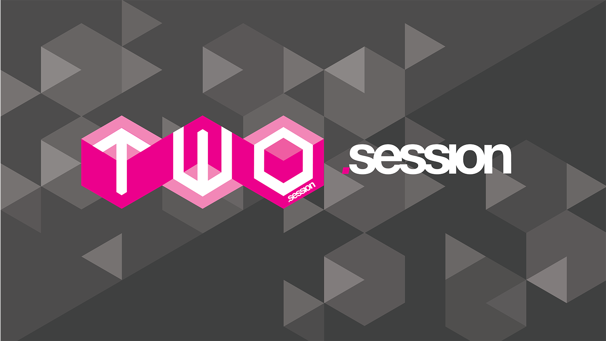
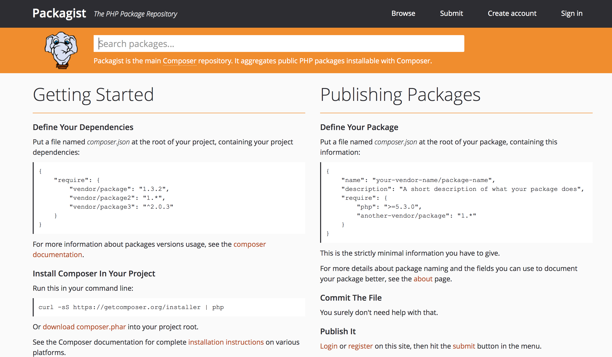
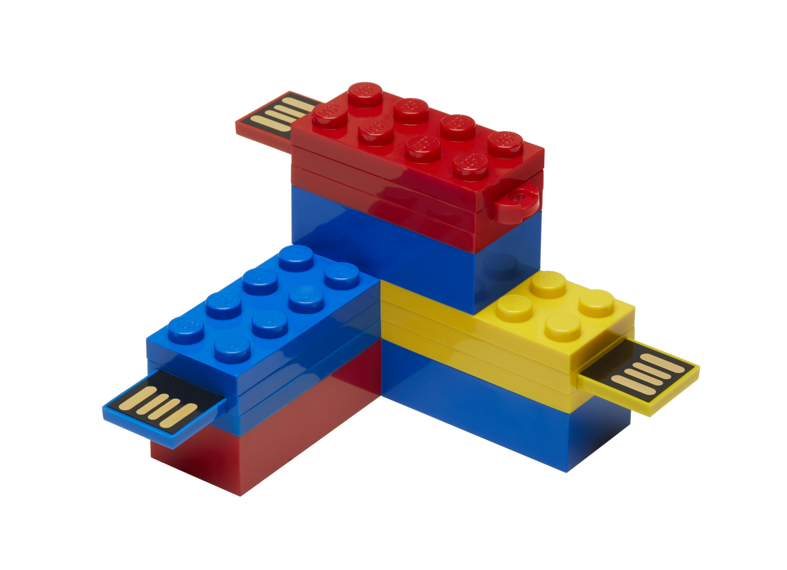

---
## [fit] _**Decoupled**_ Magento


---

### James Cowie
### Technical Team Lead Session Digital
#### t/**@jcowie** gh/**jamescowie**


---

# [fit] What is _**coupled**_ code ?


---


Coupling is the degree to which each program module relies on each one of the other program modules [^1]

[^1]: http://www.slideshare.net/fabpot/decouple-your-code-for-reusability-ipc-2008#

---


# [fit]What is **de**coupled code ?

---


**Loose coupling**

Loosely coupled code is where each of a systems modules has, or makes use of, little or no knowledge of the definitions of other separate modules[^1]

[^1]: https://en.wikipedia.org/wiki/Loose_coupling

---


Communication via stable interfaces ( API / Service Contracts )

---


# Why ?

---


# [fit] Reuse...
**verb**  _[ with obj. ]_
use again or more than once: the tape could be magnetically erased and reused.

**noun** _[ mass noun ]_
the action of using something again: the ballast was cleaned ready for reuse.

---


# [fit] Testability

---
# **D**on't **R**epeat **Y**ourself[^⌘]

[^⌘]: Cut: Command ⌘ - x, Copy: Command ⌘ - c, Paste: Command ⌘ - v


^ DRY is not about simplistic code duplication. It is about duplication of knowledge and intent.

---


# [fit]Don't re invent the wheel
Embrace the power of _**Open Source**_

---


# [fit] Composable
# Magento

^ So how can we achieve this within Magento ? Well the Magento 2 core team have put alot of thought into how reuse can occur inside of Magento 2. There have been lots of improvments in Magento 2 that make reuse possible. You will hear Composer, Service Contracts, Dependency Injection used with any Magento 2 developer now. Because the world of software engineering has evolved since the days of initial Magento 1 we are priviliaged to be able to take advantage of this in our Magento 2 development. If you look in the core of Magento 2 modules you will see that each one its now its own true module that can be reused. It has a composer.json file listing what each modules dependency is ( granted some of the modules have a dependency on every other module ) but its starting to become more decoupled so in theory we can create a magento 2 installation selecting onlt the composer packages that we want to run the store. Exclude gift messaging for example simple we just dont put this into our composer file.

---


# [fit] Service contracts


^ In Magento 2 the core developers have introduced a notion of Service Contracts. In reality these are Interfaces that all modules should: Create so that they are providing a public API of how there module works, As well as using these service contracts within there code. Why does this matter ? Well there are many reasons. Some of the most important are its making module developers think more about how the modules are used. These public API's are not API's that are consumed by a client but are how developers can extend or interact with the module they are providing a gatewaw into the internals but its a contract to say that these will never change. If I have a contract for getName it will only ever return getName and what is good is that as a consume of this module I know that there is a single place to look for these API's. What this also means is that because we are working based on these service contracts we are limiting the number of backwards compatiability breaks that could occur. The module developers are free to change the internals of there modules how it collects data processes it etc. But the Service Contract will remain the same. Only in majour version releases should we ever be introducing BC breaks.

---

# [fit] Dependency Injection


^ At its core Magento 2 supports dependency injection. What dependency injection does in its most basic form is takes the creation of objects away from the class that is using then. This means we can really start to think about re use a lot more. In conjunction with service contracts / interfaces we are able to swap out the concrete implementations at run time so we are de coupling our actual implementation of the framework from our modules. DI in Magento 2 is a vast section to cover but what I will say is that it is investing the time in looking at how dependency injection throey is created and how Magento 2 implement it. When used correctly it means that we have modules that are self contained Plain ol PHP objects that we can inject back into the framework to persist or perform framework specific actions keeping our bespoke domain code outside of the framework and only injecting it in as a bridge into Magento 2.

---

# [fit] Abstraction
# away from the framework


^ If you are using composer and the generated autoloading functionality it is practical to write code that is unaware of Magento, that sits in some other location than a Magento module but is wired into the structures and deep inheritance chain that Magento defines. The wiring however is minimal and isolated away from the code that solve the actual problem. This means you have created a solution prime for re-use because it can be re-wired or re-composed into other projects and applications.

---

# [fit] The naked
# Magento module


^ The idea of the naked module is to create code that is completely unaware that it will be applied within a Magento application. This would mean that it can also be applied to a new version of Magento with a greatly reduced amount of re-work. We get to apply DRY in the true form and only create the new wiring to Magento 2 or 3 or 4. Magento will last for ever you know!

---


# [fit] How ?

---

# [fit] Composer 



---


`composer require monolog/monolog`

---


`composer require Inviqa/StoreBuilder`

---

# [fit]To package our own module for the community

```json
{
    "name": "Jcowie/Module",
    "description": "My super cool Magento 2 module",
    "version": "1.0.0",
    "require": {        
    },
    "autoload": {
        "files": [ "registration.php" ],
        "psr-4": {
            "Jcowie\\SuperModule\\": ""
        }
    }
}

```

---


```php
<?php

\Magento\Framework\Component\ComponentRegistrar::register(
    \Magento\Framework\Component\ComponentRegistrar::MODULE,
    'Jcowie_SuperModule',
    __DIR__
);

```
---


# [fit]Lets build a
# [fit] super _**basic**_ CLI command

---


`./bin/phpspec describe Jcowie/HelloWorld/Model/HelloWorld`

---


```php
<?php
class HelloWorldSpec extends ObjectBehavior
{     
    function it_should_return_hello_world()
    {
        $this->sayHello()->shouldReturn('Hello World');
    }
}
```

---


```php
<?php
namepsace Jcowie\HelloWorld\Model;

class HelloWorld
{
  public function sayHello()
  {
    return "Hello World";
  }
}
```

---


# [fit] Now for the Magento 2 Module
### _**src/Jcowie/HelloWorldModule**_

---


```php
<?php
namespace Jcowie\HelloWorldModule\Commands;

use Symfony\Component\Console\Input\InputInterface;
use Symfony\Component\Console\Input\InputArgument;
use Symfony\Component\Console\Input\InputOption;
use Symfony\Component\Console\Output\OutputInterface;
use Symfony\Component\Console\Command\Command;

class GeneratorCommand extends Command
{
    /** @var \Jcowie\HelloWorld\Model\HelloWorld $helloWorldModel */
    private $helloWorldModel;

    /**
     * GeneratorCommand constructor.
     * @param \Jcowie\HelloWorld\Model\HelloWorld $helloWorld
     */
    public function __construct(\Jcowie\HelloWorld\Model\HelloWorld $helloWorld)
    {
        $this->helloWorldModel = $helloWorld;
        parent::__construct();
    }

    protected function configure()
    {
        $this->setName('jcowie:helloworld');
        $this->setDescription('Hello World');

        parent::configure();
    }

    protected function execute(InputInterface $input, OutputInterface $output)
    {
        $output->writeln($this->helloWorldModel->sayHello());
    }
}
```

---


# di.xml

```xml
<config xmlns:xsi="http://www.w3.org/2001/XMLSchema-instance"
  xsi:noNamespaceSchemaLocation="urn:magento:framework:ObjectManager/etc/config.xsd">
    <type name="Magento\Framework\Console\CommandList">
        <arguments>
            <argument name="commands" xsi:type="array">
                <item name="moduleCommand" xsi:type="object">
                  Jcowie\HelloWorldModule\Commands\GeneratorCommand
                </item>
            </argument>
        </arguments>
    </type>
</config>
```

---


# [fit] Smaller M2 classes

---



# Modules for reuse

---


# [fit] Service Contracts

`<?php interface Foo {} ?>`

---


# [fit] Constructor Injection

```php
public function __construct(\Jcowie\HelloWorld\Model\HelloWorld $helloWorld)
{
    $this->helloWorldModel = $helloWorld;
}
```

---


# [fit] Inject via di.xml

```xml
<type name="Jcowie\HelloWorldModule\Command\HelloWorld">
        <arguments>
          <argument name="commands" xsi:type="array">
              <item name="HelloWorld" xsi:type="string">Jcowie\HelloWorld\Model\HelloWorld</item>
          </argument>
        </arguments>
</type>
```

---


# Conclusion

   - Separate business logic from Magento logic
   - Easier to test
   - Easier to maintain
   - Leverage open source solutions 
